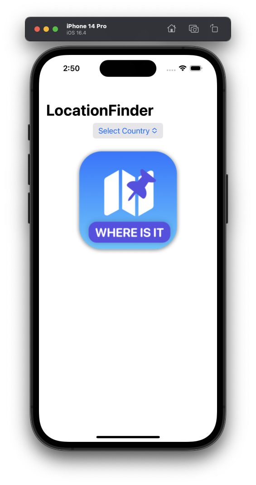
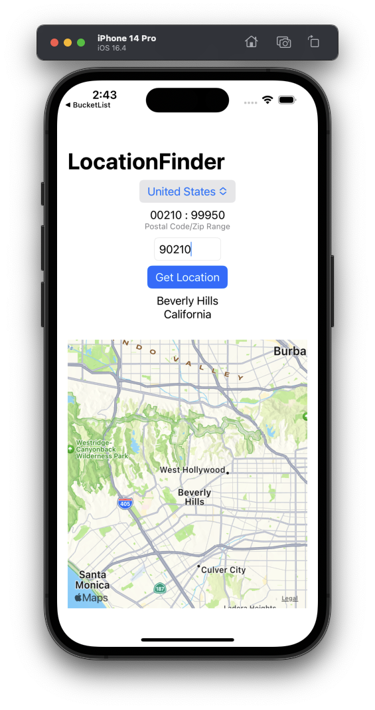

## LocationFinder
Coding Workshop from Stewart Lynch

An application that sends a postal or zip code to an external API for a selected country and receives a JSON response that we parse and use to present the location for the code and a map showing that location.

- Exploring an API
- Modelling an API response
- Loading data from the application Bundle
- Creating a Service class
- Async and Await - Swift concurrency
- MapKit

Using Zippopotam.us API
https://www.zippopotam.us

## Screenshots

  
  

